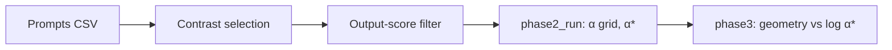

# Steerability as a Predictable Property of SAE Features

This repository contains a pipeline for studying whether **pre-steering** geometric and usage properties of sparse autoencoder (SAE) features predict their **steerability** — defined as the minimum steering coefficient required to induce a fixed on-target behavioral change — and whether harder-to-steer features produce greater off-target effects under constrained steering.

---

## Initial Proposal

Feature steering with SAEs is increasingly used for model control and alignment, but coefficient selection is often ad hoc: researchers pick a handful of values and observe outcomes. This project operationalizes steerability as a measurable, **pre-intervention** property of individual SAE features and tests whether it can be predicted from geometry and usage statistics alone — *before* any steering is applied.

The core thesis: features that are densely clustered in representation space or highly co-activated with neighboring features are more entangled, require larger steering coefficients to induce targeted effects, and (once Phase 4 exists) should show greater collateral behavioral changes when forced.

---

## Quick Overview

There are three workflows in this repository:

### Data preparation

Governed by `scripts/prepare_salad_bench.py`. Builds the SALADBench-style prompt CSV used for refusal benchmarking.

See **Datasets** and **Step 0** below.

### Feature selection and filtering

Contrast scoring (`scripts/phase2_select_contrast.py`) plus an optional Arad-style output-score filter (`scripts/compute_output_scores.py`) to drop features that do not pass a causal relevance check.

See **Steps 1–2** in the experimental pipeline.

### Steering run and analysis

The main measurement loop is `scripts/phase2_run.py` (coefficient grid, α*, W&B logging). Follow with `scripts/phase3_predictability.py` for Spearman correlations and plots linking pre-steering metrics to log(α*).

See **Steps 3–4** and **Output structure**.

---

## Style

Keep code readable: prefer descriptive names (`dataset`, `prompt`, `feature_index`) over cryptic abbreviations, keep config-driven behavior explicit, and treat **`archive/`** as reference-only (old data, configs, utilities, notes). The supported pipeline lives under `scripts/` at the repository root.

---

## Testing

There is no single `tests/` harness yet. For a quick sanity check on steering math (synthetic or full model):

```bash
PYTHONPATH=. python scripts/smoke_test_amax.py --config configs/targets/gemma2_2b_gemmascope_res16k.yaml
```

Omit `--config` to run the synthetic-only branch.

---

## Datasets

| Artifact | Role |
|----------|------|
| `data/prompts/salad_alpha.csv` | Task prompts for refusal (SALADBench-derived); produced by `prepare_salad_bench.py` |
| Neutral / control prompts | Used inside contrast selection (`phase2_select_contrast.py`) — must be structurally comparable to task prompts (see **Run gates**) |
| Legacy domain CSVs (planets/capitals/neutral, xdom) | Moved to **`archive/data/legacy/`** — not used by the SALAD pipeline |

---

## Pre-requisites

- Python 3.11–3.12
- [uv](https://docs.astral.sh/uv/) (`pip install uv` or the install script in quick start)
- GPU strongly recommended (CUDA or Apple MPS); CPU works but is slow
- HuggingFace account and token for gated weights (`google/gemma-2-2b-it`, GemmaScope)
- [Weights & Biases](https://wandb.ai/) API key for experiment tracking

Add to `.env` (loaded automatically via `python-dotenv`):

```
WANDB_API_KEY=...
HF_TOKEN=...
WANDB_PROJECT=sae-refusal-steering
WANDB_ENTITY=...          # optional but typical
WANDB_MODE=online         # or disabled
```

You do **not** need to `export` these manually if they live in `.env`.

---

## Experiment

### One-shot quick start (clean machine)

**Step 1 — Clone and install**

```bash
git clone https://github.com/Mokhan02/MI-Research.git
cd MI-Research
curl -Lsf https://astral.sh/uv/install.sh | sh
uv sync
source .venv/bin/activate   # if you use a venv; uv run also works
```

**Step 2 — Credentials**

Create `.env` as in **Pre-requisites**. Accept model licenses on HuggingFace before first run.

**Step 3 — Prepare SALADBench prompt CSV** *(skip if `data/prompts/salad_alpha.csv` already exists)*

```bash
PYTHONPATH=. python scripts/prepare_salad_bench.py \
    --out_dir data/prompts \
    --n_prompts 300 \
    --seed 42
```

**Step 4 — Feature selection: contrast scoring**

```bash
PYTHONPATH=. python scripts/phase2_select_contrast.py \
    --config configs/targets/gemma2_2b_gemmascope_res16k.yaml \
    --domain salad \
    --prompts_dir data/prompts \
    --out_dir outputs/phase2_select_salad \
    --top-k 300 \
    --scoring composite \
    --pooling max
```

Output: `outputs/phase2_select_salad/selected_features_salad.json`

**Step 5 — Output-score filtering (Arad-style causal check)**

```bash
PYTHONPATH=. python scripts/compute_output_scores.py \
    --config configs/targets/gemma2_2b_gemmascope_res16k.yaml \
    --features_path outputs/phase2_select_salad/selected_features_salad.json \
    --out_path outputs/phase2_select_salad/output_scores.json \
    --threshold 0.01 \
    --filtered_out outputs/phase2_select_salad/selected_features_filtered.json \
    --top_k 100
```

Output: `outputs/phase2_select_salad/selected_features_filtered.json` (the feature list used for the main run).

**Step 6 — Main steering run**

```bash
PYTHONPATH=. python scripts/phase2_run.py \
    --config configs/targets/gemma2_2b_gemmascope_res16k.yaml \
    --mode refusal \
    --prompt_csv data/prompts/salad_alpha.csv \
    --fixed_features_path outputs/phase2_select_salad/selected_features_filtered.json \
    --out_dir outputs/phase2_fullrun \
    --layer 20 \
    --n_prompts 100 \
    --batch_size 32
```

`--fixed_features_path` is **required** for valid science: omitting it triggers random feature sampling (runs are tagged accordingly). The α grid is defined in config (default includes `0, 0.25, 0.5, 1, 2, 3, 5`). On a GH200/H100-class GPU, expect on the order of tens of minutes.

**Step 7 — Geometry and correlation analysis**

```bash
PYTHONPATH=. python scripts/phase3_predictability.py \
    --config configs/targets/gemma2_2b_gemmascope_res16k.yaml \
    --run_dir outputs/phase2_fullrun \
    --out_dir outputs/steerability_analysis \
    --layer 20
```

Output: `outputs/steerability_analysis/correlations.csv` plus plots.

### Device selection

Configs default to `device: "auto"`, which prefers MPS (Apple Silicon), then CUDA, then CPU. Override in YAML or with `--device` where a script supports it.

---

## Experimental pipeline

The pipeline moves from **raw prompts → ranked features → filtered features → steering curves → predictability analysis**:



Outputs are deterministic given seeds except where sampling is explicit. If you already have `outputs/phase2_select_salad/selected_features_filtered.json` from a prior run, you can start at **Step 6** after confirming prompts and config match your paper plan.

---

### Diagnostics (by step)

#### Step 0: Prompt preparation (`scripts/prepare_salad_bench.py`)

| Question | What we measure |
|----------|-------------------|
| Do we have a fixed, versioned prompt set? | Writes `salad_alpha.csv` under `data/prompts/` |

**Why this matters:** Downstream refusal rates and α* are only comparable across runs if the prompt distribution is frozen.

---

#### Step 1: Contrast-based feature selection (`scripts/phase2_select_contrast.py`)

| Question | What we measure |
|----------|-------------------|
| Which features fire more on task than on neutral text? | Δ = act_freq_task − act_freq_neutral; top-K by composite score |

**Why this matters:** Selecting by raw activation alone confounds prevalence with *task-specific* signal; contrast targets features aligned with the behavioral domain.

---

#### Step 2: Output-score filter (`scripts/compute_output_scores.py`)

| Question | What we measure |
|----------|-------------------|
| Which selected features actually move the model’s output distribution on prompts? | Output-side score vs threshold; keep top subset |

**Why this matters:** Decoder directions can be statistically salient without being causally influential; this step mirrors an Arad-style relevance screen.

---

#### Step 3: Measuring steerability (`scripts/phase2_run.py`)

Steering: `h' = h + α · v_f` where `v_f` is the SAE decoder direction for feature `f`.

| Metric | Definition / use |
|--------|-------------------|
| **Steerability α*(f)** | Minimum α such that Δrefusal ≥ threshold `T` (pre-registered in config) |
| **Censoring** | Features that never reach `T` must not be assigned α* = max(α); treat as no-effect for correlations |

**Why this matters:** This is the **dependent variable** for Phase 3 — it must be measured on a fixed feature set and a fixed α grid.

---

#### Step 4: Predicting steerability (`scripts/phase3_predictability.py`)

| Question | What we measure |
|----------|-------------------|
| Do pre-steering geometry predict log(α*)? | Spearman ρ, regression, scatter plots (density, co-activation, max cosine to neighbors, etc.) |

**Why this matters:** If geometry explains little variance, coefficient search may be inherently high-variance for SAE steering at this layer/scale.

---

#### Step 5 (planned): Off-target analysis

Not implemented in the main branch yet. Intended: collateral behavioral metrics at α*(f) and at a fixed low α₀.

---

### The big picture

| Level | Question | Steps |
|-------|----------|-------|
| **Data** | Is the benchmark fixed and reproducible? | 0 |
| **Features** | Which directions are task-specific and output-relevant? | 1–2 |
| **Behavior** | What α achieves a pre-registered refusal shift? | 3 |
| **Mechanism hypothesis** | Does entanglement predict hardness of steering? | 4 |
| **Side effects** | What breaks when we push harder features? | 5 (planned) |

---

### Output structure

```
outputs/
  phase2_select_salad/
    selected_features_salad.json
    selected_features_filtered.json   # after Step 2
    output_scores.json
    feature_summary_*.csv
  phase2_fullrun/
    run_rows.csv
    alpha_star.csv
    feature_summary.csv
    curves_per_feature.parquet
    ...
  steerability_analysis/
    correlations.csv
    plots/
```

---

## Experiment tracking (W&B)

Runs log to the `sae-refusal-steering` project (override with `WANDB_PROJECT` in `.env`). Typical run names:

| Script | Run name pattern | Key artifacts |
|--------|------------------|---------------|
| `phase2_select_contrast.py` | `phase2_select_{domain}` | `feature_metrics` |
| `phase2_run.py` | `phase2_run_{mode}` | curves, prompt tables, α*, diagnostics |
| `phase3_predictability.py` | `phase3_{run_name}` | correlation tables, figures |

Set `WANDB_MODE=disabled` to run locally only.

---

## Configuration

YAML configs live under `configs/` and inherit from `configs/base.yaml`.

| Config | Use |
|--------|-----|
| `configs/targets/gemma2_2b_gemmascope_res16k.yaml` | Gemma-2-2b-it + GemmaScope res-16k, layer 20 (primary) |
| `configs/targets/gemma2_2b_base_gemmascope_res16k.yaml` | Base model variant |

---

## Models and SAE (reference)

| Component | Value |
|-----------|--------|
| Model | `google/gemma-2-2b-it` (main) or `google/gemma-2-2b` (base config) |
| SAE | GemmaScope res-16k, layer 20 (`google/gemma-scope-2b-pt-res`) |
| Hook | `blocks.20.hook_resid_post` → `model.layers.20` |
| Features | 16,384 total; 300 contrast-selected; 100 after output filter (default commands above) |
| Steering grid | α ∈ {0.0, 0.25, 0.5, 1.0, 2.0, 3.0, 5.0} (from config; cap avoids degenerate generations) |
| Threshold | T = 0.10 on refusal Δ for α* (see config / gates) |

---

## Run gates and landmines

Before a full paper run, work through **[archive/docs/GATES.md](archive/docs/GATES.md)** (seven gates: splits, contrast selection, micro-sweep, censoring, etc.).

For common analysis traps (τ_act, token span, pre-registration, controls), see **[archive/docs/LANDMINES.md](archive/docs/LANDMINES.md)**.

**Do not use archived scripts or datasets for production results** — see **`archive/README.md`** for what lives there and why.

---

## Key files

| Path | Purpose |
|------|---------|
| `src/model_utils.py` | Model load + auto device |
| `src/sae_loader.py` | GemmaScope decoder loading |
| `src/hook_resolver.py` | TransformerLens ↔ HuggingFace hook names |
| `src/refusal_scorer.py` | Keyword-based refusal classifier |
| `src/config.py` | Config load/validation |

---

## Hypotheses

| Hypothesis | What would support it |
|------------|------------------------|
| Geometry predicts steerability | Significant positive Spearman ρ between density / co-activation and log α*(f) |
| Entangled features → more collateral damage | (Phase 4) Correlation of geometry with off-target metrics |
| Steerability vs off-target are related but distinct | Positive trend with non-trivial residual structure |

---

## Limitations

- **Cost** — large grids × many features × benchmarks are expensive.
- **Single stack** — MVP targets Gemma-2-2b layer 20; generalization unknown.
- **Threshold semantics** — `T` on refusal is behavior-specific.
- **External validity** — unclear transfer across depth, family, or SAE width.

---

## Related work

| Paper | Takeaway |
|-------|----------|
| [SAEs Are Good for Steering](https://arxiv.org/abs/2505.20063) | Steering works best on causally influential features |
| [Geometry of Categorical Concepts in LLMs](https://arxiv.org/abs/2406.01506) | Cleaner geometry ↔ better semantic alignment |

---

## Team

Girish, Akshaj, Mo, Aashna, Shlok

[Research doc](https://docs.google.com/document/d/1c-gnQnJlBCQvK3M607sx0QAn8XebIgnVtDrnkB0pQQ0/edit?tab=t.itpz4hcr2hqi#heading=h.4uarl9d0uyvr)
